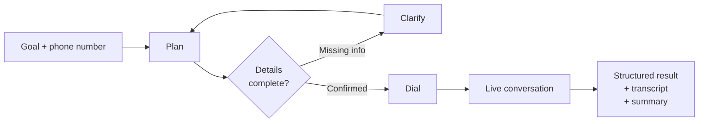
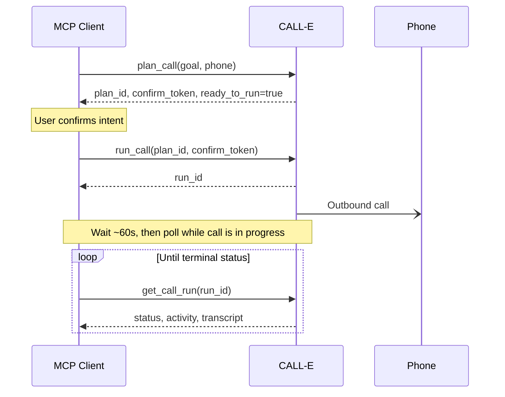

<div align="center">
  
# CALL-E Integrations

**CALL-E is your AI agent for getting phone work done.**

Tell CALL-E your goal, and it handles the phone task end-to-end: it plans, calls, adapts in real time, follows through, and improves along the way.

Use CALL-E directly, or integrate it into agents, platforms, and business systems through Skills, Plugins, SDKs, or APIs.

**New users get 20 free calls to get started. [Sign up now!](https://www.heycall-e.com/)**

[Website](https://www.heycall-e.com/) · [Docs](https://docs.heycall-e.com/) · [Try on ClawHub](https://clawhub.ai/call-e-dev/phone-call-calle) · [Discord](https://discord.gg/6AbXUzUV8w)


</div>

## Quick Start

**The fastest path — paste this into any AI agent (Claude Code, Codex, Cursor, and more):**

```text
Install CALL-E for me: https://open.heycall-e.com/document/mcp-archive/CALL-E-installation-guide.md
```

Your agent handles the rest.

**SDK — five lines to your first call:**

```ts
import { CalleClient } from "@call-e/calle"; // pnpm add @call-e/calle

const client = new CalleClient({ apiKey: "your_api_key" });
const call = await client.calls.createAndWait({
  task: "Call +15550123456 and confirm tomorrow's 9am appointment.",
});
console.log(call.status, call.taskCompleted);
```

## Contents

- [What is CALL-E?](#what-is-call-e)
- [Capabilities](#capabilities)
- [Get Started](#get-started)
  - [Agent Install](#agent-install)
  - [MCP](#mcp)
  - [SDK](#sdk)
  - [API](#api)
- [Supported Regions and Languages](#supported-regions-and-languages)
- [Examples](#examples)
- [Troubleshooting](#troubleshooting)
- [In Development](#in-development)
- [Repository Structure](#repository-structure)
- [Telemetry](#telemetry)
- [Development](#development)
- [Community](#community)

---

## What is CALL-E?

CALL-E automates goal-driven phone tasks that scripted voice bots cannot handle.

Traditional calling platforms use prebuilt bots optimized for high-volume, repetitive scripts. CALL-E is different: you describe a goal, and CALL-E figures out how to achieve it over the phone. It handles natural conversation, adapts to unexpected responses, and returns a structured result when the call ends.

This makes CALL-E practical for tasks where a rigid script would fail — appointment confirmations, research calls, follow-ups, lead qualification.

**Call lifecycle:**



---

## Capabilities

| Capability | Description |
| --- | --- |
| **Live Task Progress** | Track a call from planning to completion: status, activity history, outcomes, and next steps |
| **Smart Goal Clarification** | CALL-E asks for missing details — recipient, timing, language, success criteria — before dialing |
| **Managed Call Execution** | Handles number setup, outbound dialing, monitoring, and result capture |
| **Structured Results** | Returns summaries, transcripts, and schema-validated structured data you can act on directly |
| **Scheduled and Batch Calling** | Schedule individual calls or send a batch task to multiple recipients |
| **In-Task Optimization** | Adapts call strategy based on prior attempts within the same task |
| **Real-World Voice Handling** | Manages live pickup, voicemail, call screening, hold, transfers, silence, and interruptions |
| **IVR Navigation** | Detects and navigates IVR menus during outbound calls, using DTMF keypad input when needed to reach the requested department, queue, automated service, or person |
| **Multiple Integration Paths** | Agent plugins, MCP, SDKs, APIs, and enterprise systems |
| **Safety and Governance** | Number governance, rate limits, concurrency controls, blocklists, kill switches, redacted logs, and audit trails |

## In Development

**Goal-Driven Long Tasks** — CALL-E plans a multi-step task end-to-end: it designs the calling approach, executes the calls, learns from real outcomes, and continuously improves its strategy over time. This goes beyond single calls — CALL-E learns how to achieve each phone-based goal more reliably across attempts. This feature is under active development and not yet generally available.

## Get Started

Choose the integration path that fits your use case:

| Use case | Integration | Start here |
| --- | --- | --- |
| Use CALL-E inside Claude Code, Codex, Cursor, OpenClaw, Hermes, or any skills.sh agent | Agent install | [Agent Install](#agent-install) |
| Connect any Streamable HTTP MCP client | MCP | [MCP](#mcp) |
| Call CALL-E from a TypeScript or Python SDK | SDK | [SDK](#sdk) |
| Call CALL-E from any backend | Developer API | [API](#api) |

---

### Agent Install

**Paste this single prompt into your agent for automatic setup:**
```text
Install CALL-E for me: https://open.heycall-e.com/document/mcp-archive/CALL-E-installation-guide.md
```
Works in Claude Code, Codex, Cursor, and any agent that can run shell commands. The linked guide stays up to date, so the prompt never changes.

For manual setup, expand the table below or see the [full install guide](https://github.com/CALLE-AI/call-e-integrations/blob/main/docs/install/install-guide.md).

### MCP

CALL-E exposes a Streamable HTTP MCP endpoint. Any compatible MCP client can connect, authorize via OAuth, and run CALL-E with three tools.

**Endpoint:**

```text
https://seleven-mcp-sg.airudder.com/mcp/openagent_oauth
```

**Transport:** Streamable HTTP

**Tool flow:**



**Tools:**

| Tool | What it does |
| --- | --- |
| `plan_call` | Creates or refines a call plan. Does **not** place a call. Returns `plan_id`, `confirm_token`, and `ready_to_run`. |
| `run_call` | Starts the planned call. Requires the exact `plan_id` and `confirm_token` from the preceding `plan_call`. **Can place a real phone call.** |
| `get_call_run` | Reads run status, activity, summary, and transcript. Read-only. After a call starts, wait ~60 seconds before the first poll, then every 5–10 seconds until terminal. |

<!-- sync-with: docs/mcp/openagent-oauth.md#reliable-terminal-state-workflow -->
The ~60-second delay is a polling recommendation, not a completion deadline.
Persist the returned `run_id` and resume `get_call_run` after a local timeout
or restart; do not call `run_call` again. MCP `run_call` does not accept a
`webhook_url`, so MCP clients should poll `get_call_run` for completion.

For OAuth details, tool contracts, setup, and the completion workflow, see
the [MCP guide](https://github.com/CALLE-AI/call-e-integrations/blob/main/docs/mcp/openagent-oauth.md#reliable-terminal-state-workflow).

### SDK

CALL-E server SDKs are available for TypeScript and Python. Use them in trusted backend services, workers, and automation systems.

**Install:**

```bash
# TypeScript
pnpm add @call-e/calle

# Python
pip install calle-ai
```

**Set your API key:**

```bash
export CALLE_API_KEY="iams_live_example"
```

Get your API key from the [CALL-E dashboard](https://dashboard.heycall-e.com/account/api-keys).

**TypeScript:**

```ts
import { CalleClient } from "@call-e/calle";

const client = new CalleClient({ apiKey: process.env.CALLE_API_KEY! });

const call = await client.calls.createAndWait({
  task: "Call <E164_PHONE> and confirm whether they can attend Friday lunch.",
  resultSchema: {
    type: "object",
    required: ["can_attend"],
    properties: {
      can_attend: { type: "string", enum: ["yes", "no", "unknown"] },
    },
  },
});

console.log(call.status);
console.log(call.taskCompleted);
console.log(call.completionConfidence);
console.log(call.structuredResult);
console.log(call.evidence);
```

**Python:**

```python
import os
from calle import CalleClient

client = CalleClient(api_key=os.environ["CALLE_API_KEY"])

call = client.calls.create_and_wait(
    task="Call <E164_PHONE> and confirm whether they can attend Friday lunch.",
    result_schema={
        "type": "object",
        "required": ["can_attend"],
        "properties": {
            "can_attend": {"type": "string", "enum": ["yes", "no", "unknown"]},
        },
    },
)

print(call["status"])
print(call["task_completed"])
print(call["structured_result"])
print(call["evidence"])
```

### API

The CALL-E Developer API provides direct HTTP access for any trusted backend, worker, or workflow system.

**Set credentials:**

```bash
export CALLE_API_KEY="iams_live_example"
export CALLE_BASE_URL="https://api.heycall-e.com"
```

**Endpoints:**

| Method | Path | Description |
| --- | --- | --- |
| `POST` | `/v1/calls` | Create a one-recipient or batch call task. |
| `GET` | `/v1/calls/{call_id}` | Read status, summaries, structured results, and transcripts. |
| `GET` | `/v1/calls/{call_id}/events` | List developer-facing call events. |
| `POST` | `/calle/webhook` | Receive terminal call result webhooks. |

**Create a call:**

```bash
curl "$CALLE_BASE_URL/v1/calls" \
  --request POST \
  --header "Authorization: Bearer $CALLE_API_KEY" \
  --header "Content-Type: application/json" \
  --header "Idempotency-Key: wf_123_friday_lunch" \
  --data '{
    "task": "Call each recipient and ask whether they can attend Friday lunch.",
    "recipients": [
      { "phones": ["<E164_PHONE>"],
        "region": "US",
        "locale": "en-US"
      }
    ],
    "result_schema": {
      "type": "object",
      "required": ["completed_count"],
      "properties": {
        "completed_count": {
          "type": "integer"
        }
      }
    },
    "recipient_result_schema": {
      "type": "object",
      "required": ["can_attend"],
      "properties": {
        "can_attend": {
          "type": "string",
          "enum": ["yes", "no", "unknown"]
        }
      }
    },
    "metadata": {
      "workflow_run_id": "wf_123"
    },
    "webhook_url": "https://example.com/calle/webhook"
  }'
```

**Read a result:**

```bash
curl "$CALLE_BASE_URL/v1/calls/call_123" \
  --header "Authorization: Bearer $CALLE_API_KEY"
```

**Terminal call result:**

<details>
<summary>Example response</summary>

```json
{
  "status": "completed",
  "task_completed": true,
  "completion_confidence": { "score": 0.92, "label": "high" },
  "evidence": ["The recipient said they can attend Friday lunch."],
  "structured_result": { "completed_count": 1 },
  "recipients": [
    {
      "structured_result": { "can_attend": "yes" },
      "attempts": [
        {
          "transcript_turns": [
            { "offset_seconds": 0, "speaker": "bot", "text": "Hi, I am calling about Friday lunch." },
            { "offset_seconds": 4, "speaker": "user", "text": "Yes, I can attend." }
          ]
        }
      ]
    }
  ]
}
```

</details>

For authentication, webhooks, and the full reference, see the [API docs](https://docs.heycall-e.com/#/api-reference).

---

## Supported Regions and Languages

Use these country codes with the SDK and API recipient settings.

| Country | Country Code | Calling Code | Languages | Line Region |
| --- | --- | --- | --- | --- |
| United States of America | `US` | +1 | English | Local |
| Singapore | `SG` | +65 | English | Local |
| Malaysia | `MY` | +60 | English, Chinese, Malay | Local |
| India | `IN` | +91 | English, Hindi, Tamil | International |
| United Arab Emirates | `AE` | +971 | English, Arabic | Local |
| Australia | `AU` | +61 | English | Local |
| Canada | `CA` | +1 | English | International |
| United Kingdom of Great Britain and Northern Ireland | `GB` | +44 | English | International |
| Viet Nam | `VN` | +84 | Vietnamese, English | International |
| Germany | `DE` | +49 | English, German | International |
| Japan | `JP` | +81 | Japanese, English | International |
| France | `FR` | +33 | French, English | International |
| Mexico | `MX` | +52 | Spanish, English | Local |
| Brazil | `BR` | +55 | Portuguese, English | Local |
| Indonesia | `ID` | +62 | English | International |
| Philippines | `PH` | +63 | English | International |
| Kenya | `KE` | +254 | English | International |
| Netherlands | `NL` | +31 | English | International |
| Poland | `PL` | +48 | Polish, English | International |
| Bangladesh | `BD` | +880 | Bengali, English | International |
| Nigeria | `NG` | +234 | English | International |
| Oman | `OM` | +968 | English, Arabic | International |
| Thailand | `TH` | +66 | English, Thai | International |
| Namibia | `NA` | +264 | English | International |
| Cameroon | `CM` | +237 | English, French | International |
| Mozambique | `MZ` | +258 | English, Portuguese | International |
| Saudi Arabia | `SA` | +966 | English, Arabic | International |
| Finland | `FI` | +358 | English, Finnish | International |
| Ukraine | `UA` | +380 | English, Ukrainian | International |
| Sri Lanka | `LK` | +94 | English, Tamil, Sinhala | International |
| Botswana | `BW` | +267 | English | International |
| Pakistan | `PK` | +92 | English, Urdu | International |
| Turkey | `TR` | +90 | Turkish | International |
| Honduras | `HN` | +504 | English, Spanish | International |
| Spain | `ES` | +34 | English, Spanish | International |
| Taiwan | `TW` | +886 | English | International |
| South Africa | `ZA` | +27 | English | International |
| Egypt | `EG` | +20 | English, Arabic | International |
| Ghana | `GH` | +233 | English | International |
| Israel | `IL` | +972 | English, Hebrew | International |
| Ireland | `IE` | +353 | English | International |
| Tunisia | `TN` | +216 | English | International |

**Notes**

- **Local** means calls are placed using a local phone line for the destination country or region.
- **International** means calls are currently placed using CALL-E's international phone numbers and are primarily intended for testing. For production use with a local phone number, contact the CALL-E team to enable a local line for the destination country.

---

## Examples

Runnable demos are in [examples/](https://github.com/CALLE-AI/call-e-integrations/blob/main/examples):

| Example | What it shows |
| --- | --- |
| [Standard MCP OAuth clients](https://github.com/CALLE-AI/call-e-integrations/blob/main/examples/mcp-oauth-client) | TypeScript and Python clients connecting to CALL-E via standard MCP OAuth over Streamable HTTP. Good starting point for any new MCP client. |
| [CALL-E broker login MCP clients](https://github.com/CALLE-AI/call-e-integrations/blob/main/examples/mcp-broker-client) | TypeScript and Python clients using CALL-E brokered login, local token caching, and MCP HTTP calls. Useful when the environment cannot complete a browser OAuth flow. |
| [Python batch runner](https://github.com/CALLE-AI/call-e-integrations/blob/main/examples/python-batch-runner) | Python JSONL batch runner using `calle` CLI auth state, FastMCP, Rich output, and MCP tool-call metadata. Demonstrates processing multiple call tasks from a file. |

These are starting-point demos, not the canonical SDK or API contract.

---

## Troubleshooting

If installation, authentication, or MCP tool verification fails, see the [CALL-E troubleshooting guide](https://github.com/CALLE-AI/call-e-integrations/blob/main/docs/install/troubleshooting.md).

Common issues covered:

- **Cursor sandbox network restrictions** — `CONNECT tunnel failed, response 403` means the Cursor agent shell is blocking outbound HTTPS. Fix: switch Cursor Auto-Run Mode to **Run Everything (Unsandboxed)** in Cursor Settings → Agents.
- **`calle auth login` failures** — fetch failures, login errors, and token cache issues.
- **Missing MCP tools** — how to confirm that `plan_call`, `run_call`, and `get_call_run` are available after install.

## Repository Structure

This is a multi-ecosystem integration monorepo. Each integration has its own package and marketplace entry point.

| Path | Purpose |
| --- | --- |
| `packages/cli` | Shared `calle` CLI. Handles authentication, token caching, MCP tool discovery, and call workflow shortcuts. Used by all agent integrations. |
| `packages/core` | Shared core library used across packages. |
| `packages/codex-plugin` | Codex plugin providing the `$calle` skill. |
| `packages/claude-plugin` | Claude Code plugin providing the `/calle:calle` skill. |
| `packages/cursor-plugin` | Cursor plugin bundling the MCP server config, `calle` skill, and real-call safety rule. |
| `packages/openclaw-cli-skill` | OpenClaw CALL-E skill source. |
| `packages/skills-sh-skill` | skills.sh compatible CALL-E skill package. |
| `skills/calle/` | Portable `calle` skill for public skills.sh search and install. |
| `examples/` | Runnable MCP client demos. |
| `docs/` | Integration guides, install docs, and troubleshooting. |

For layout rules and marketplace naming conventions, see [docs/agent-integration-layout.md](https://github.com/CALLE-AI/call-e-integrations/blob/main/docs/agent-integration-layout.md).

---

## Telemetry

The `calle` CLI sends best-effort usage telemetry to help diagnose installation, authentication, and tool availability issues.

**What is collected:** anonymous installation ID, CLI version, integration source (e.g. `claude/claude_code_plugin/<version>`), command stage, outcome, error type, and server host hash.

**What is never collected:** phone numbers, call goals, OAuth tokens, broker login URLs, transcripts, or contact data.

**Opt out** with `--no-telemetry`. First follow
[CLI entry point selection](packages/cli/docs/cli-reference.md#selecting-the-cli-entry-point)
to prepare the launcher and a JSON request. Add `--no-telemetry` to its `argv`:

```json
["auth", "status", "--no-telemetry"]
```

Broker and MCP requests still create service-side security, audit, and operational logs required to run calls.

---

## Development

Requires Node `>=22` and pnpm `>=10.18.3`, Changesets, and GitHub Actions.

```bash
pnpm install
pnpm check
pnpm test
pnpm pack:dry-run
```

<details>
<summary>Package-specific checks</summary>

```bash
pnpm --filter @call-e/core check
pnpm --filter @call-e/core test
pnpm --filter @call-e/cli check
pnpm --filter @call-e/cli test
pnpm --filter @call-e/codex-plugin check
pnpm --filter @call-e/codex-plugin test
pnpm --filter @call-e/claude-plugin check
pnpm --filter @call-e/claude-plugin test
pnpm --filter @call-e/cursor-plugin check
pnpm --filter @call-e/cursor-plugin test
pnpm --filter @call-e/openclaw-cli-skill check
pnpm --filter @call-e/openclaw-cli-skill test
pnpm --filter @call-e/skills-sh-skill check
pnpm --filter @call-e/skills-sh-skill test
pnpm run check:examples
```

</details>

For user-visible package changes, add a changeset. The release workflow publishes changed @call-e/* packages to npm and maintains the @call-e/codex-plugin@latest and @call-e/claude-plugin@latest install aliases.

See [CONTRIBUTING.md](https://github.com/CALLE-AI/call-e-integrations/blob/main/CONTRIBUTING.md) for pull request guidelines.

---

## Community

- Website: [heycall-e.com](https://www.heycall-e.com/)
- Docs: [docs.heycall-e.com](https://docs.heycall-e.com/)
- Discord: [discord.gg/6AbXUzUV8w](https://discord.gg/6AbXUzUV8w)
